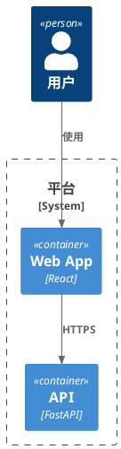
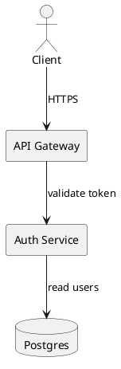

# PlantUML 制图

## 与 Agent 系统 Prompt 的分工

| 层 | 位置 | 内容 |
|----|------|------|
| **角色与工作流** | `agents/napkin-architect/system_prompt.md` | 先渲染、出错就修、不甩锅到外部编辑器 |
| **运行时** | `agents/napkin-architect/profile.yaml` | `render_plantuml` 工具 |
| **语法与修复（对内）** | 本 Skill | PlantUML/C4 写法、常见错误、修复策略 |

触发本 Skill 后，脚本编写与修复以本文为准；**每次改完必须 `render_plantuml`**。

## Skill 资源（只有这两个，路径必须完全一致）

| 资源 | 何时读 |
|------|--------|
| `references/c4-cheatsheet.md` | 需要 C4 宏/元素速查时 |
| `references/plantuml-tips.md` | 需要布局/序列图技巧时 |

**硬性规则**：

- **不要**读取上表以外的路径。不存在 `FAQ`、`c4-compatibility`、`references/FAQ` 等文件。
- 渲染失败时，**优先读本 Skill 正文「常见错误与修复」**，直接改脚本并 `render_plantuml`；不要反复 `read_skill_resource` 碰运气。
- `load_skill` 加载本 Skill 后，正文已足够应对大多数修复；仅缺 C4 宏细节时再读 cheatsheet。

## 渲染工具

```text
render_plantuml(source=<完整脚本>, title=<制品标题>)
```

- **成功**：`status: queued`，聊天出现 SVG 制品（侧栏放大 / 复制源码 / 下载 SVG 或 PNG）。
- **失败**：`status: error`，读 `message` 与 `normalized_source`，改脚本后**再次调用**，直到成功。

平台渲染器与 IDE 插件版本解耦；以工具返回为准，不要假设本地插件行为。

## 脚本基础

1. 始终提交**完整**脚本；可省略 `@startuml`/`@enduml` 时工具会自动补全。
2. 一行一条语句；字符串用英文双引号；避免中文标点混入语法。
3. 节点 ID 用 ASCII（`UserService`、`api_gateway`），显示名用 `as "显示名"`。
4. 长脚本分段注释 `' --- section ---`，便于 diff。

## C4（PlantUML）

优先使用 **C4-PlantUML** 宏（Kroki/stdlib 已内置）：



层级选择：

| 用户意图 | 推荐 |
|----------|------|
| 系统与外部角色 | `C4_Context.puml` / `C4_Container.puml` |
| 服务/模块拆分 | `C4_Container.puml` |
| 类/模块内部 | `C4_Component.puml` |
| 动态交互 | `C4_Dynamic.puml` 或序列图 |

**Include 失败时**（路径/版本）：

1. 改用 `!include <C4/C4_Container>` 形式（尖括号 stdlib），不要硬编码 GitHub raw URL。
2. 仍失败则降级为原生 `component`/`rectangle` + `Rel()`，保留 C4 语义命名。
3. 不要同时混用多套 C4 include。

## 常见错误与修复

| 症状 / message 关键词 | 处理 |
|----------------------|------|
| `Syntax Error` / `Cannot parse` | 检查括号、引号、关键字拼写；删除 trailing comma |
| `Unknown directive` / include | 换 stdlib `!include <C4/...>` 或内联元素 |
| `No such element` / undefined | 先定义节点再 `Rel`；别名大小写一致 |
| `Duplicate identifier` | 全局唯一 ID；子 graph 内不重复 |
| skinparam 无效 | 去掉或改用通用 `skinparam`；避免实验性参数 |
| 中文乱码 | 显示名用 Unicode 没问题；ID 保持 ASCII |
| Kroki / server error | 简化脚本（减节点、缩短标签、去掉可疑 include），再渲染 |

修复循环：

1. 从 `normalized_source` 定位行号（若 message 含 line）。
2. **最小改动**修复，不要重写无关部分。
3. 立即 `render_plantuml` 验证。
4. 连续 3 次同类错误 → 换简化建模（减节点或降级图类型），并向用户说明。

## 架构图表达建议

- **Context**：3–7 个主块；外部系统放边界外。
- **Container**：每个容器一行职责；Rel 上写协议/方向。
- **Sequence**：`autonumber`；激活条 `activate`/`deactivate` 成对。
- **Deployment**：用 `node`/`cloud`/`database` 区分运行时。

## 示例：最小组件图



调用 `render_plantuml` 时 `title` 示例：`「认证链路 · 组件图」`。

## 更多参考

- C4 元素与 Rel 约定 → `read_skill_resource` + `references/c4-cheatsheet.md`
- 原生 PlantUML 布局/序列技巧 → `read_skill_resource` + `references/plantuml-tips.md`
