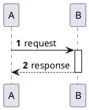
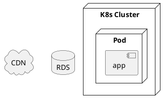

# PlantUML 技巧

## 布局

- `left to right direction` / `top to bottom direction`
- `together { ... }` 拉近相关节点
- `hide empty description` 减少空白

## 序列图

- `->` 实线，`-->` 虚线；`->>` 异步风格。
- `note right of A: 说明`

## 部署

## 稳定性

- 避免未文档化的 beta 指令。
- 大型图：拆成多张或 `package`/`together` 分组。
- 颜色：`skinparam` 少而精；C4 已有主题时不要重复覆盖。
