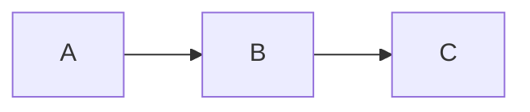
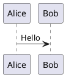

# Slidev Markdown Syntax

Core Markdown syntax for Slidev presentations.

## Slide Separator

Use `---` with blank lines before and after:

```md
# Slide 1

Content

---

# Slide 2

More content
```

## Headmatter (Deck Config)

First frontmatter block configures the entire deck:

```md
---
theme: default
title: My Presentation
lineNumbers: true
---

# First Slide
```

## Per-Slide Frontmatter

Each slide can have its own frontmatter:

```md
---
layout: center
background: /image.jpg
class: text-white
---

# Centered Slide
```

## Presenter Notes

HTML comments at end of slide become presenter notes:

```md
# My Slide

Content here

<!--
These are presenter notes.
- Remember to mention X
- Demo the feature
-->
```

## Code Blocks

Standard Markdown with Shiki highlighting:

````md
```ts
const hello = 'world'
```
````

With features:
````md
```ts {2,3}              // Line highlighting
```ts {1|2-3|all}        // Click-based highlighting
```ts {monaco}           // Monaco editor
```ts {monaco-run}       // Runnable code
```ts twoslash           // TypeScript types
```
````

## LaTeX Math

Inline: `$E = mc^2$`

Block:
```md
$$
\frac{-b \pm \sqrt{b^2 - 4ac}}{2a}
$$
```

## Diagrams

Mermaid:
````md

````

PlantUML:
````md

````

## Comark Syntax

Enable with `comark: true`:

```md
[styled text]{style="color:red"}
{width=500px}
::component{prop="value"}
```

## Scoped CSS

Styles apply only to current slide:

```md
# Red Title

<style>
h1 { color: red; }
</style>
```

## Embedded HTML

Slidev renders inline HTML when it is **not** inside a fenced code block and **not** indented as Markdown code (4 leading spaces).

```md
# Cards

<div class="cards">
<div class="item">First</div>
<div class="item">Second</div>
</div>

<style>
.cards { display: grid; grid-template-columns: 1fr 1fr; gap: 1rem; }
.item { padding: 1rem; border: 1px solid #ddd; border-radius: 8px; }
</style>
```

Rules:

- Start block HTML tags at column 0 (no leading spaces before `<`).
- Do **not** wrap layout markup in ` ```html ` fences unless you intentionally show HTML source code.
- Prefer built-in layouts (`two-cols`, `center`, `fact`) and Markdown lists/tables before custom HTML grids.

## Import Slides

```md
---
src: ./pages/intro.md
---
```

Import specific slides:
```md
---
src: ./other.md#2,5-7
---
```
